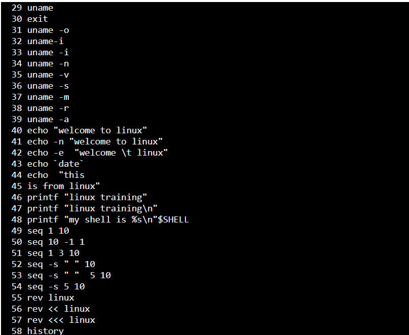
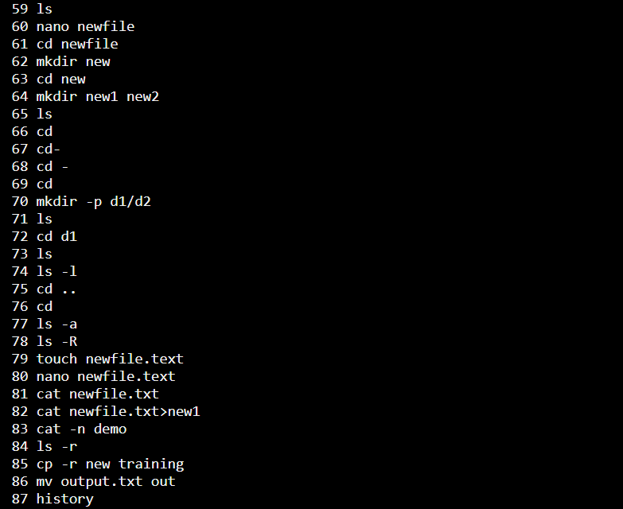
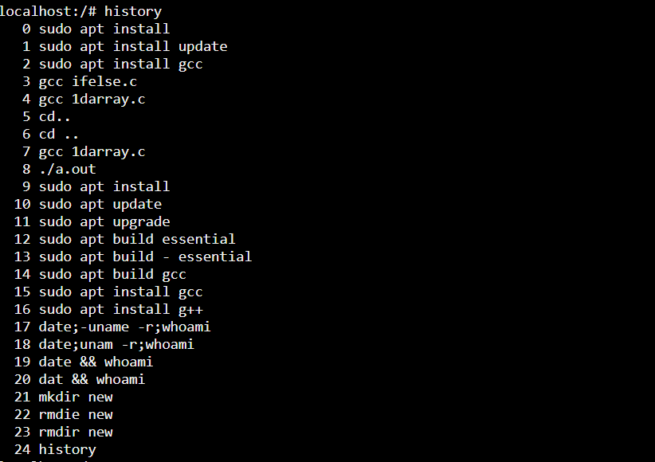
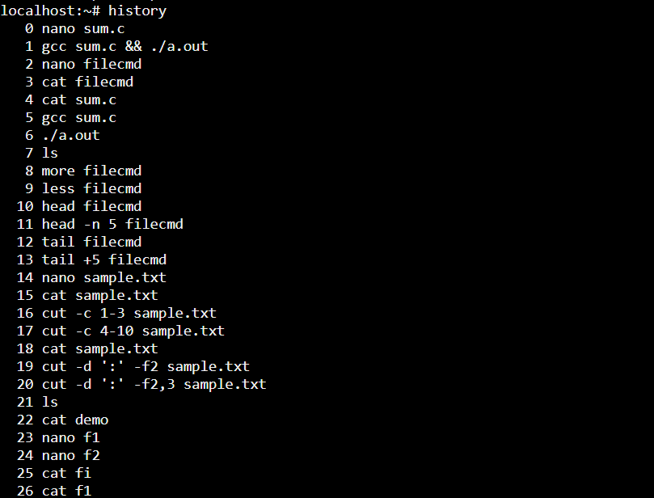
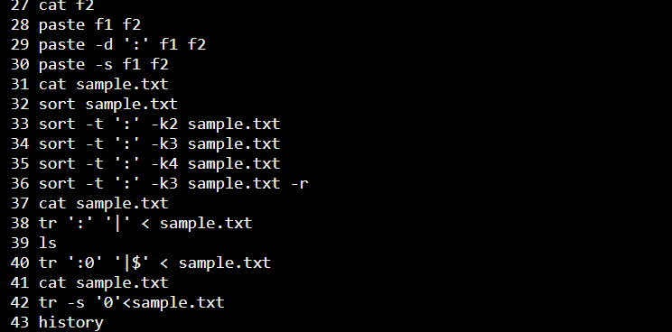
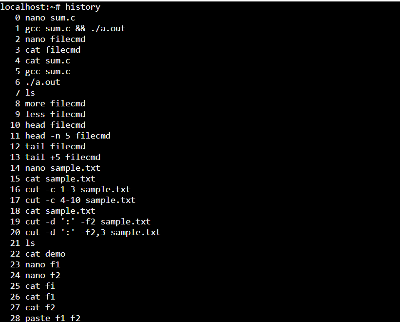
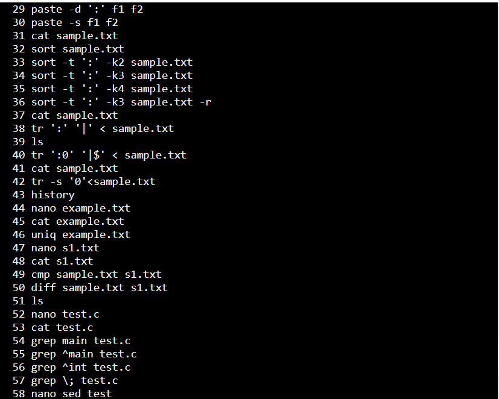
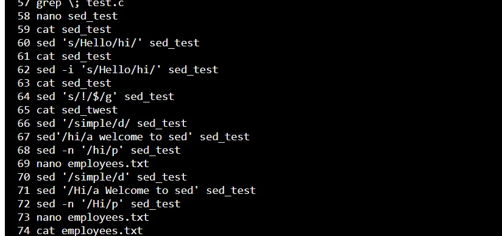
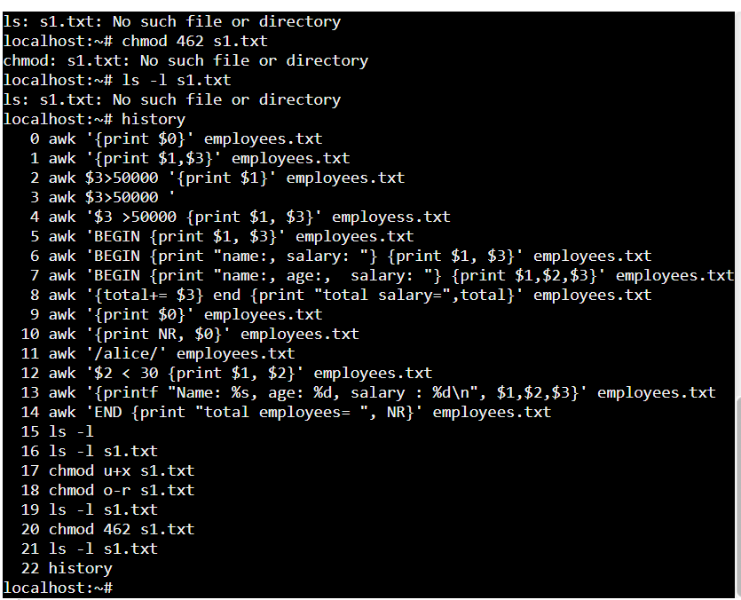

# 5211165_Harshitha-CS
## SDLC Certificate

## GIT certificate

## Linux Commands

## Linux Commands

## Linux Commands

## Linux Commands

## Linux Commands

## Linux Commands

## Linux Commands

## Linux Commands

## Linux Commands

## linux commands

## switch case

#include <stdio.h>
int main() {
    int a;
    while(1){
    printf("enter from 1 to 7\n");
    scanf("%d" , &a);
    
    switch(a){
        case 1:printf("monday");
               break;
        case 2:printf("tuesday");
               break;
        case 3:printf("wednesday");
               break;
        case 4:printf("thursday");
               break;
        case 5:printf("friday");
               break;
        case 6:printf("saturday");
               break;
        case 7:printf("sunday");
               break;
        default:printf("enter valid number");
                continue;
         
    }
    break;
    }
    return 0;
}

